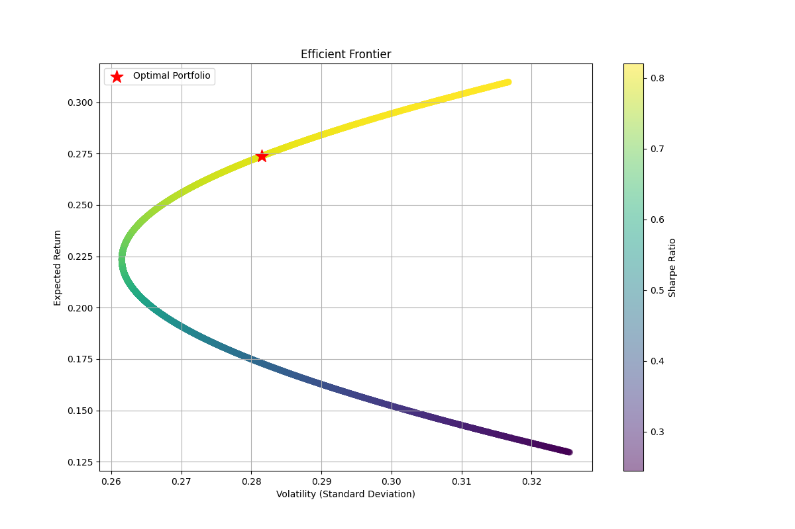

# Portfolio Optimization using Markowitz Model


## 📊 Project Overview

This project implements the Modern Portfolio Theory (MPT) using the Markowitz Model to optimize investment portfolios. It provides a robust framework for portfolio optimization, risk assessment, and performance analysis across different stock pairs.

## 🎯 Key Features

- **Portfolio Optimization**: Implements the Markowitz Model to find optimal asset allocations
- **Risk Analysis**: Calculates portfolio volatility, expected returns, and Sharpe ratios
- **Diversification Analysis**: Evaluates correlation between assets and optimal diversification strategies
- **Monte Carlo Simulation**: Generates random portfolios to visualize the efficient frontier
- **Comparative Analysis**: Analyzes multiple stock pairs across different sectors
- **Data Visualization**: Creates intuitive plots for portfolio performance and efficient frontier

## 📈 Methodology

### 1. Data Collection
- Historical price data retrieval using Yahoo Finance API
- Daily returns calculation and annualization
- Correlation and covariance matrix computation

### 2. Portfolio Optimization
- Implementation of Markowitz Model
- Minimum weight constraints for diversification
- Sharpe ratio maximization
- Efficient frontier calculation

### 3. Risk Analysis
- Volatility measurement
- Expected return calculation
- Risk-adjusted return metrics (Sharpe ratio)
- Correlation analysis

## 🏆 Results

### Optimal Portfolio Allocations

| Stock Pair | Asset 1 | Weight 1 | Asset 2 | Weight 2 | Expected Return | Volatility | Sharpe Ratio |
|------------|---------|----------|---------|----------|-----------------|------------|--------------|
| AAPL-XOM   | AAPL    | 80.00%   | XOM     | 20.00%   | 27.38%         | 28.15%     | 0.80         |
| MSFT-JNJ   | MSFT    | 80.00%   | JNJ     | 20.00%   | 25.64%         | 26.05%     | 0.79         |
| GOOGL-PG   | GOOGL   | 55.64%   | PG      | 44.36%   | 17.33%         | 22.37%     | 0.55         |
| AMZN-KO    | AMZN    | 68.87%   | KO      | 31.13%   | 18.09%         | 26.60%     | 0.49         |

### Efficient Frontier Visualization


## 🛠️ Technical Implementation

### Project Structure
```
Portfolio Optimization using Markowitz Model/
├── portfolio_optimizer.py    # Core optimization logic
├── data_loader.py           # Data retrieval and processing
├── monte_carlo.py           # Monte Carlo simulation
├── plotter.py               # Visualization utilities
├── run_analysis.py          # Main analysis script
├── tests/                   # Unit tests
├── images/                  # Project images
└── portfolio_analysis/      # Analysis results
    ├── comparative_analysis.md
    └── [stock_pair_results]/
```

### Dependencies
- Python 3.8+
- pandas
- numpy
- scipy
- yfinance
- matplotlib
- seaborn

## 🚀 Getting Started

1. Clone the repository:
```bash
git clone https://github.com/Sakeeb91/portfolio-optimization.git
cd portfolio-optimization
```

2. Install dependencies:
```bash
pip install -r requirements.txt
```

3. Run the analysis:
```bash
python run_analysis.py
```

## 📚 Key Learnings

1. **Portfolio Theory Implementation**:
   - Practical application of Modern Portfolio Theory
   - Understanding of risk-return tradeoffs
   - Implementation of optimization algorithms

2. **Data Analysis Skills**:
   - Financial data processing
   - Statistical analysis
   - Correlation and covariance calculations

3. **Software Engineering**:
   - Modular code design
   - Unit testing
   - Documentation
   - Data visualization

## 🔍 Future Enhancements

1. **Advanced Features**:
   - Multi-asset portfolio optimization
   - Transaction cost consideration
   - Dynamic rebalancing strategies

2. **Risk Management**:
   - Value at Risk (VaR) calculation
   - Conditional Value at Risk (CVaR)
   - Stress testing scenarios

3. **User Interface**:
   - Web-based interface
   - Interactive visualizations
   - Custom portfolio builder

## 🤝 Contributing

Contributions are welcome! Please feel free to submit a Pull Request.

## 📄 License

This project is licensed under the MIT License - see the [LICENSE](LICENSE) file for details.

## 📧 Contact

For any questions or suggestions, please feel free to reach out!

---

*Note: This project is for educational purposes only. Past performance does not guarantee future results. Always consult with a financial advisor before making investment decisions.* 